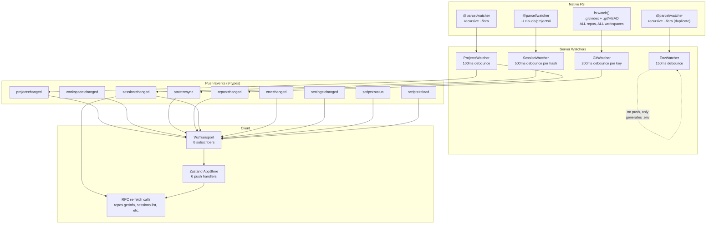
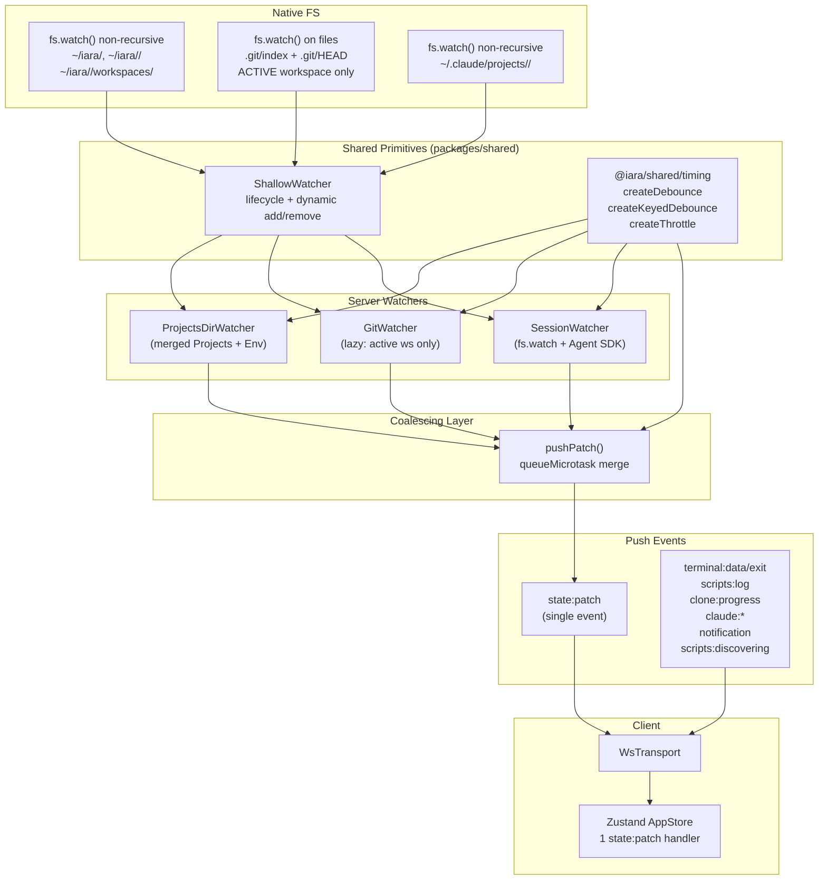
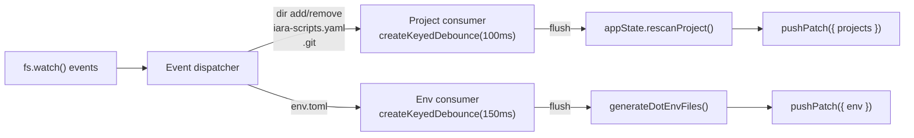

# File Watcher Refactor — Design

## Component Architecture

### Current State



### Target State



## Code Reuse Analysis

### Existing code to leverage

| Component                  | Location                                   | Reuse                                                              |
| -------------------------- | ------------------------------------------ | ------------------------------------------------------------------ |
| `fs.watch()` pattern       | `git-watcher.ts:86-97`                     | Extract into ShallowWatcher                                        |
| Keyed debounce pattern     | `git-watcher.ts:100-113`                   | Extract into `createKeyedDebounce`                                 |
| Own-write suppression      | `watcher.ts:84-89`, `env-watcher.ts:70-72` | Keep in consumers, backed by `createKeyedDebounce` for auto-expiry |
| `getRepoInfo()`            | `services/repos.ts`                        | Called by GitWatcher flush + `state.init`                          |
| Agent SDK `listSessions()` | `@anthropic-ai/claude-agent-sdk` (v0.2.79) | Replaces `services/sessions.ts` JSONL parsing                      |
| `computeProjectHash()`     | `services/sessions.ts`                     | Keep for SessionWatcher hash computation                           |
| `generateDotEnvFiles()`    | `services/env.ts`                          | Called by env consumer in merged watcher                           |
| AppState `rescanProject()` | `services/state.ts`                        | Called by project consumer in merged watcher                       |
| `pushAll()`                | `ws.ts:16-24`                              | Wrapped by new `pushPatch()` coalescing layer                      |

### Code to remove

| Target                                         | Location                                  | Replaced by                                                            |
| ---------------------------------------------- | ----------------------------------------- | ---------------------------------------------------------------------- |
| `@parcel/watcher` dependency                   | `package.json`, all watchers              | `ShallowWatcher` + `fs.watch()`                                        |
| Custom JSONL parsing                           | `services/sessions.ts:69-90`              | Agent SDK `listSessions()`                                             |
| `repos.getInfo` RPC                            | `handlers/projects.ts`, `contracts/ws.ts` | Zustand `repoInfo` from `state.init` + `state:patch`                   |
| `sessions.list` / `sessions.listByProject` RPC | `handlers/sessions.ts`                    | Zustand `sessions` from `state.init` + `state:patch`                   |
| `env.list` RPC                                 | `handlers/env.ts`                         | Zustand `env` from `state.init` + `state:patch`                        |
| `scripts.load` / `scripts.status` RPC          | `handlers/scripts.ts`                     | Zustand `scripts` + `scriptStatuses` from `state.init` + `state:patch` |
| `app.info` / `app.capabilities` RPC            | `handlers/app.ts`                         | `state.init` expanded response                                         |
| 9 granular push events                         | `contracts/ws.ts` WsPushEvents            | Single `state:patch`                                                   |

---

## Component Definitions

### 1. `@iara/shared/timing`

**Purpose:** Zero-dependency timing primitives replacing hand-rolled `setTimeout`/`clearTimeout` patterns across all watchers.

**Location:** `packages/shared/src/timing.ts`

**Exports:**

```ts
/** Simple single-key debounce. */
export function createDebounce<T extends (...args: any[]) => void>(
  ms: number,
  fn: T,
): { call: (...args: Parameters<T>) => void; cancel: () => void; flush: () => void };

/** Per-key debounce — each key has an independent timer. */
export function createKeyedDebounce<K = string>(
  ms: number,
  fn: (keys: K[]) => void,
): {
  schedule: (key: K) => void;
  cancel: (key: K) => void;
  cancelAll: () => void;
  flush: () => void;
};

/** Throttled batcher — collects items, flushes at most once per interval. */
export function createThrottle<T>(
  ms: number,
  fn: (items: T[]) => void,
): { push: (item: T) => void; flush: () => void; cancel: () => void };
```

**Implementation notes:**

- `createDebounce`: Standard `clearTimeout`/`setTimeout` with stored last args for `flush()`.
- `createKeyedDebounce`: Internal `Map<K, NodeJS.Timeout>`, accumulates pending `Set<K>`, calls `fn` with all pending keys on timer fire. Multiple keys that fire within the same window are batched into a single `fn` call. `cancelAll()` clears all timers (used on watcher stop).
- `createThrottle`: Accumulates items in an array, schedules a single `setTimeout` on first push after flush. Subsequent pushes within the window just append. On timer fire, calls `fn` with accumulated items and resets. Used for log batching (FW-004) and WS coalescing (FW-007).
- ~50 lines total, zero external dependencies.

**Package.json change:** Add `"./timing"` subpath export in `packages/shared/package.json`.

**Dependencies:** None (pure `setTimeout`/`clearTimeout`).

**Requirement coverage:** FW-012

---

### 2. `@iara/shared/shallow-watcher`

**Purpose:** Thin wrapper around `fs.watch()` providing lifecycle management (start/stop), dynamic path add/remove, ENOENT recovery, and event callback normalization.

**Location:** `packages/shared/src/shallow-watcher.ts`

**Interface:**

```ts
export interface ShallowWatcherOptions {
  /** Called when a change is detected. `filename` may be null on some platforms. */
  onChange: (watchedPath: string, eventType: string, filename: string | null) => void;
  /** Called when an error occurs and a path is auto-removed. */
  onError?: (watchedPath: string, error: Error) => void;
}

export class ShallowWatcher {
  constructor(options: ShallowWatcherOptions);

  /** Add a directory or file to watch (non-recursive). Idempotent — skips if already watched. */
  add(targetPath: string): void;

  /** Remove a watched path. Closes the underlying fs.watch handle. */
  remove(targetPath: string): void;

  /** Check if a path is being watched. */
  has(targetPath: string): boolean;

  /** Get count of active watches. */
  get size(): number;

  /** Close all watches and clear internal state. */
  stop(): void;
}
```

**Implementation notes:**

- Internal `Map<string, fs.FSWatcher>` stores active handles.
- `add()` calls `fs.watch(targetPath)` — works for both directories (non-recursive) and files.
- On `error` event (ENOENT, EPERM), auto-removes the path and calls `onError` callback. This handles the case where a directory is deleted while being watched.
- On `rename` event for a watched directory (directory itself removed), the handle fires an error automatically — `fs.watch()` behavior on Linux/macOS.
- `stop()` calls `.close()` on every watcher, clears the map.
- No debouncing built in — consumers use `@iara/shared/timing` for debounce/throttle.
- ~40 lines.

**Package.json change:** Add `"./shallow-watcher"` subpath export.

**Dependencies:** `node:fs` only.

**Requirement coverage:** FW-012

---

### 3. `ProjectsDirWatcher` (merged Projects + Env)

**Purpose:** Single watcher service that maintains shallow `fs.watch()` handles on `~/iara` and its subdirectories, dispatching events to two internal consumers: project-structure changes and env.toml changes. Replaces both `ProjectsWatcher` and `EnvWatcher`.

**Location:** `apps/server/src/services/projects-dir-watcher.ts`

**Interface:**

```ts
export class ProjectsDirWatcher {
  constructor(projectsDir: string, appState: AppState, pushPatch: PushPatchFn);

  /** Start watching — sets up initial shallow watches. */
  start(): void;

  /** Stop all watches and cancel pending debounce timers. */
  stop(): void;

  /** Mark a path as own-write to suppress the next watcher event. */
  suppressWrite(fullPath: string): void;

  /** Re-scan watched directories (call after project/workspace create/delete). */
  refresh(): void;
}
```

**Watched paths (all non-recursive via ShallowWatcher):**

| Path                                  | Purpose                                                               | Filename filter                         |
| ------------------------------------- | --------------------------------------------------------------------- | --------------------------------------- |
| `~/iara/`                             | Project dir add/remove                                                | Any directory                           |
| `~/iara/<project>/`                   | Repo `.git` add/remove, `iara-scripts.yaml` change, `env.toml` change | `.git`, `iara-scripts.yaml`, `env.toml` |
| `~/iara/<project>/workspaces/`        | Workspace dir add/remove                                              | Any directory                           |
| `~/iara/<project>/workspaces/<slug>/` | `env.toml` change in workspace                                        | `env.toml`                              |

**Internal flow:**



**Event dispatch logic:**

1. `onChange(watchedPath, eventType, filename)` receives raw events.
2. Compute `rel = path.relative(projectsDir, path.join(watchedPath, filename))`.
3. Parse `parts = rel.split(path.sep)` to determine what changed:
   - `parts.length === 1` → project dir add/remove → project consumer
   - `parts[1] === 'workspaces' && parts.length === 3` → workspace add/remove → project consumer
   - `filename === 'iara-scripts.yaml'` → project consumer
   - `filename === '.git'` → project consumer
   - `filename === 'env.toml'` → env consumer
4. Both consumers use `createKeyedDebounce` keyed by project slug.

**Own-write suppression:**

- `suppressWrite(fullPath)` adds path to a `Map<string, NodeJS.Timeout>` with 1s auto-expiry.
- In `onChange`, check if the resolved path is suppressed before dispatching.

**Dynamic path management (`refresh()`):**

- Called after project/workspace create/delete.
- Reads current projects from `appState.getState().projects`.
- Computes expected watch set: `~/iara/` + per-project + per-workspace dirs.
- Diffs against `ShallowWatcher.has()` — adds missing, removes stale.

**Requirement coverage:** FW-008, FW-011

---

### 4. `GitWatcher` (refactored — lazy watching)

**Purpose:** Watches `.git/index` and `.git/HEAD` for repos in the **active workspace only**. On workspace switch, tears down old watches and sets up new ones, then pushes fresh `repoInfo`.

**Location:** `apps/server/src/services/git-watcher.ts` (in-place refactor)

**Interface changes:**

```ts
export class GitWatcher {
  constructor(appState: AppState, pushPatch: PushPatchFn);

  /** Start watching repos for all project root workspaces. */
  start(): void;

  /** Switch to watching a specific workspace. Tears down previous ws watches. */
  switchWorkspace(workspaceId: string): void;

  /** Stop watching a specific project entirely (for project delete). */
  unwatchProject(projectSlug: string): void;

  /** Refresh watches for a project (for repo add/remove). */
  watchProject(projectSlug: string): void;

  /** Stop all watches. */
  stop(): void;
}
```

**Lazy watching strategy:**

- On `start()`: Watch project-root repos only (the "main" workspace for each project). These are always relevant.
- On `switchWorkspace(wsId)`: If `wsId` refers to a non-main workspace, add watches for that workspace's repos. Tear down watches for the previously active non-main workspace.
- Internal `activeWorkspaceId: string | null` tracks which non-main workspace is watched.
- Debounce via `createKeyedDebounce(300)` keyed by `workspaceId ?? "project:<slug>"`.
- On flush: calls `getRepoInfo(appState, projectSlug, wsSlug)` and pushes via `pushPatch({ repoInfo: { [wsId]: info } })`.

**Uses `ShallowWatcher`:** Yes — for file watching on `.git/index` and `.git/HEAD` paths. The ShallowWatcher handles ENOENT recovery when git files are temporarily absent during operations like rebase.

**Requirement coverage:** FW-009, FW-012

---

### 5. `SessionWatcher` (refactored — fs.watch + Agent SDK)

**Purpose:** Watches `~/.claude/projects/<hash>/` directories for `.jsonl` file creation/modification, then calls Agent SDK `listSessions()` to get full session data and pushes via `state:patch`.

**Location:** `apps/server/src/services/session-watcher.ts` (in-place refactor)

**Interface changes:**

```ts
export class SessionWatcher {
  constructor(pushPatch: PushPatchFn, appState: AppState);

  /** Rebuild watches for all workspaces. */
  async refresh(): Promise<void>;

  /** Stop all watches. */
  stop(): void;
}
```

**Key changes from current:**

- Replace `@parcel/watcher.subscribe()` with `ShallowWatcher.add()` per hash directory.
- Filter for `.jsonl` filename in onChange callback.
- Use `createKeyedDebounce(2000)` (2s window) to avoid reacting to every Claude message write. Only needs to catch: new session creation and title renames.
- On debounce flush: call `listSessions({ dir: hashDir })` from `@anthropic-ai/claude-agent-sdk` instead of manual JSONL parsing.
- Push data directly: `pushPatch({ sessions: { [wsId]: sessionInfoList } })` for each workspace mapped to the hash.

**Agent SDK integration:**

```ts
import { listSessions } from "@anthropic-ai/claude-agent-sdk";

// On flush for a given hash:
const sdkSessions = await listSessions({ dir: hashDir });
const sessions: SessionInfo[] = sdkSessions.map(mapSDKSession);
for (const wsId of hashToWorkspaceIds.get(hash)!) {
  pushPatch({ sessions: { [wsId]: sessions } });
}
```

**`SessionInfo` mapping from SDK:**

```ts
function mapSDKSession(sdk: SDKSessionInfo): SessionInfo {
  return {
    id: sdk.sessionId,
    filePath: sdk.filePath ?? "", // may need to derive
    cwd: sdk.cwd ?? "",
    title: sdk.customTitle ?? sdk.summary ?? sdk.firstPrompt ?? "(untitled)",
    createdAt: sdk.createdAt ?? sdk.lastModified,
    lastMessageAt: sdk.lastModified,
    messageCount: 0, // SDK doesn't expose this directly; drop if unused
    gitBranch: sdk.gitBranch,
  };
}
```

**Requirement coverage:** FW-006, FW-011

---

### 6. `sessions.ts` service (refactored)

**Purpose:** Replaces manual JSONL parsing with Agent SDK calls. Keeps `computeProjectHash()` (used by SessionWatcher).

**Location:** `apps/server/src/services/sessions.ts` (in-place refactor)

**Changes:**

- `listSessions(repoDirs)` → calls `listSessions({ dir })` from Agent SDK for each dir, maps results to `SessionInfo[]`.
- Remove `getSessionMetadata()`, `jsonlEntrySchema`, `readFileSync`/`readdirSync` calls.
- Keep `computeProjectHash()` — still needed by SessionWatcher to map workspace dirs to hash dirs.

**Requirement coverage:** FW-006

---

### 7. Push Coalescing Layer

**Purpose:** Coalesce multiple `state:patch` pushes within the same tick into a single WebSocket message per client.

**Location:** `apps/server/src/services/push.ts` (new file)

**Interface:**

```ts
import type { WsPushEvents } from "@iara/contracts";

export type StatePatch = WsPushEvents["state:patch"];
export type PushPatchFn = (patch: StatePatch) => void;

/** Create a coalescing push function that batches state:patch within the same tick. */
export function createPushPatch(pushAll: typeof import("../ws.js").pushAll): PushPatchFn;
```

**Implementation:**

```ts
export function createPushPatch(pushAll: PushAllFn): PushPatchFn {
  let pending: StatePatch | null = null;

  return (patch: StatePatch) => {
    if (!pending) {
      pending = { ...patch };
      queueMicrotask(() => {
        const merged = pending!;
        pending = null;
        pushAll("state:patch", merged);
      });
    } else {
      // Deep-merge into pending
      mergePatch(pending, patch);
    }
  };
}

function mergePatch(target: StatePatch, source: StatePatch): void {
  if (source.projects) target.projects = source.projects;
  if (source.settings) target.settings = source.settings;
  // Record fields: shallow merge by key
  for (const field of ["repoInfo", "sessions", "env", "scripts", "scriptStatuses"] as const) {
    if (source[field]) {
      target[field] = { ...(target[field] as any), ...source[field] };
    }
  }
}
```

**Why `queueMicrotask` not `setTimeout`:**

- Zero added latency for single pushes — fires at the end of the current microtask queue.
- Naturally batches pushes that occur within the same synchronous flush (e.g., project rescan + env regen).
- No configurable window needed — the microtask boundary is the natural coalescing point.

**Requirement coverage:** FW-007

---

### 8. Contract Changes (`packages/contracts`)

#### 8a. New `state:patch` push event type

**File:** `packages/contracts/src/ws.ts`

Add to `WsPushEvents`:

```ts
"state:patch": {
  projects?: Project[];
  settings?: Record<string, string>;
  repoInfo?: Record<string, RepoInfo[]>;
  sessions?: Record<string, SessionInfo[]>;
  env?: Record<string, EnvData>;
  scripts?: Record<string, ScriptsConfig>;
  scriptStatuses?: Record<string, ScriptStatus[]>;
};
```

Remove from `WsPushEvents`: `project:changed`, `workspace:changed`, `repos:changed`, `session:changed`, `env:changed`, `state:resync`, `scripts:reload`, `scripts:status`, `settings:changed`.

#### 8b. Expanded `state.init` response

**File:** `packages/contracts/src/ws.ts`

```ts
"state.init": {
  params: Record<string, never>;
  result: {
    projects: Project[];
    settings: Record<string, string>;
    repoInfo: Record<string, RepoInfo[]>;
    sessions: Record<string, SessionInfo[]>;
    env: Record<string, EnvData>;
    scripts: Record<string, ScriptsConfig>;
    scriptStatuses: Record<string, ScriptStatus[]>;
    appInfo: AppInfo;
    capabilities: AppCapabilities;
  };
};
```

#### 8c. Removed RPC methods

Remove from `WsMethods`: `app.info`, `app.capabilities`, `repos.getInfo`, `sessions.list`, `sessions.listByProject`, `env.list`, `scripts.load`, `scripts.status`.

#### 8d. Cleanup

Remove `ProjectFileSchema` and `WorkspaceFileSchema` from `packages/contracts/src/schemas.ts`.

**Requirement coverage:** FW-001

---

### 9. `state.init` handler (expanded)

**Purpose:** Return full hydration in a single RPC call.

**Location:** `apps/server/src/handlers/app.ts` (in-place refactor)

**Changes:**

- Merge `app.info` and `app.capabilities` data into `state.init` response.
- Add `env`, `scripts`, `scriptStatuses` fields.
- Remove `registerMethod("app.info", ...)` and `registerMethod("app.capabilities", ...)`.

```ts
registerMethod("state.init", async () => {
  const { projects, settings } = appState.getState();
  const repoInfoMap: Record<string, RepoInfo[]> = {};
  const sessionsMap: Record<string, SessionInfo[]> = {};
  const envMap: Record<string, EnvData> = {};
  const scriptsMap: Record<string, ScriptsConfig> = {};
  const scriptStatusesMap: Record<string, ScriptStatus[]> = {};

  const tasks: Promise<void>[] = [];

  for (const project of projects) {
    // Scripts config (keyed by projectId)
    tasks.push(
      loadScriptsConfig(project)
        .then((c) => {
          scriptsMap[project.id] = c;
        })
        .catch(() => {}),
    );

    for (const workspace of project.workspaces) {
      const wsId = workspace.id;
      tasks.push(
        getRepoInfo(appState, project.slug, workspace.slug)
          .then((i) => {
            repoInfoMap[wsId] = i;
          })
          .catch(() => {
            repoInfoMap[wsId] = [];
          }),
      );
      tasks.push(
        listSessions([appState.getWorkspaceDir(wsId)])
          .then((s) => {
            sessionsMap[wsId] = s;
          })
          .catch(() => {
            sessionsMap[wsId] = [];
          }),
      );
      tasks.push(
        loadEnvData(appState, wsId)
          .then((e) => {
            envMap[wsId] = e;
          })
          .catch(() => {}),
      );
      tasks.push(
        getScriptStatuses(project, workspace)
          .then((s) => {
            scriptStatusesMap[wsId] = s;
          })
          .catch(() => {
            scriptStatusesMap[wsId] = [];
          }),
      );
    }
  }

  await Promise.allSettled(tasks);

  return {
    projects,
    settings,
    repoInfo: repoInfoMap,
    sessions: sessionsMap,
    env: envMap,
    scripts: scriptsMap,
    scriptStatuses: scriptStatusesMap,
    appInfo: { version: "0.0.1", platform: process.platform, isDev },
    capabilities: { claude: commandExists("claude"), platform: process.platform },
  };
});
```

**Requirement coverage:** FW-001

---

### 10. Client-Side `state:patch` Handler

**Purpose:** Single handler in `useAppStore.subscribePush()` that merges partial state updates.

**Location:** `apps/web/src/stores/app.ts` (in-place refactor)

**New store state fields:**

```ts
interface AppState {
  projects: Project[];
  settings: Record<string, string>;
  repoInfo: Record<string, RepoInfo[]>;
  sessions: Record<string, SessionInfo[]>;
  env: Record<string, EnvData>;
  scripts: Record<string, ScriptsConfig>;
  scriptStatuses: Record<string, ScriptStatus[]>;
  appInfo: AppInfo;
  capabilities: AppCapabilities;
  selectedWorkspaceId: string | null;
  initialized: boolean;
}
```

**Merge strategy:**

```ts
transport.subscribe("state:patch", (patch) => {
  set((state) => {
    const next: Partial<AppState> = {};

    // Full-replace fields
    if (patch.projects) next.projects = patch.projects;
    if (patch.settings) next.settings = patch.settings;

    // Shallow-merge-by-key fields
    if (patch.repoInfo) next.repoInfo = { ...state.repoInfo, ...patch.repoInfo };
    if (patch.sessions) next.sessions = { ...state.sessions, ...patch.sessions };
    if (patch.env) next.env = { ...state.env, ...patch.env };
    if (patch.scripts) next.scripts = { ...state.scripts, ...patch.scripts };
    if (patch.scriptStatuses)
      next.scriptStatuses = { ...state.scriptStatuses, ...patch.scriptStatuses };

    // Orphan pruning when projects change
    if (patch.projects) {
      const validWsIds = new Set(patch.projects.flatMap((p) => p.workspaces.map((w) => w.id)));
      const validProjectIds = new Set(patch.projects.map((p) => p.id));
      for (const field of ["repoInfo", "sessions", "env", "scriptStatuses"] as const) {
        const map = next[field] ?? state[field];
        const pruned = { ...map };
        for (const key of Object.keys(pruned)) {
          if (!validWsIds.has(key)) delete pruned[key];
        }
        next[field] = pruned;
      }
      // scripts keyed by projectId
      const scriptMap = next.scripts ?? state.scripts;
      const prunedScripts = { ...scriptMap };
      for (const key of Object.keys(prunedScripts)) {
        if (!validProjectIds.has(key)) delete prunedScripts[key];
      }
      next.scripts = prunedScripts;

      // Prune terminal + scripts stores synchronously
      pruneTerminalStore(validWsIds);
      pruneScriptsStore(validWsIds);
    }

    return next;
  });
});
```

**Key differences from current:**

- **One handler** instead of 6 subscribers.
- **Static imports** for terminal/scripts stores (no dynamic `import()`) — eliminates microtask delay.
- **Single `set()` call** — all state changes in one batch, one React commit.
- **No re-fetch** — all data arrives in the patch itself.

**Removed methods:** `refreshRepoInfo()`, `refreshSessions()`, `refreshSessionsByProject()`, `onProjectChanged()`, `onWorkspaceChanged()`, `onStateResync()`, `onSettingsChanged()`.

**Requirement coverage:** FW-001, FW-005

---

### 11. WorkspaceView useEffect Fix

**Purpose:** Stabilize the fetch interval dependency.

**Location:** `apps/web/src/components/WorkspaceView.tsx`

**Change:**

```diff
- useEffect(() => {
-   // fetch + interval
- }, [workspace]);
+ const workspaceId = workspace?.id;
+ useEffect(() => {
+   if (!workspaceId) return;
+   // fetch + interval
+ }, [workspaceId]);
```

Also remove the second `useEffect` that calls `refreshRepoInfo` — no longer needed since `state:patch` carries `repoInfo`.

**Requirement coverage:** FW-003

---

### 12. Log Batching

**Purpose:** Batch high-frequency `scripts:log` push events into fewer state updates.

**Location:** `apps/web/src/stores/scripts.ts`

**Change:**

```ts
import { createThrottle } from "@iara/shared/timing";

// In subscribePush():
const logBatcher = createThrottle<{ scriptId: string; line: string }>(50, (items) => {
  const logs = new Map(get().logs);
  // Group by scriptId
  const grouped = new Map<string, string[]>();
  for (const { scriptId, line } of items) {
    const arr = grouped.get(scriptId) ?? [];
    arr.push(line);
    grouped.set(scriptId, arr);
  }
  for (const [scriptId, lines] of grouped) {
    const existing = logs.get(scriptId) ?? [];
    const combined = [...existing, ...lines].slice(-MAX_LOG_LINES);
    logs.set(scriptId, combined);
  }
  set({ logs });
});

const unsubLog = transport.subscribe("scripts:log", ({ scriptId, line }) => {
  logBatcher.push({ scriptId, line });
});
```

At 100 lines/sec, this produces ~20 state updates/sec (one every 50ms) instead of 100.

**Requirement coverage:** FW-004

---

### 13. Mutation Handlers Push `state:patch`

**Purpose:** After mutation RPCs complete, push updated state via `state:patch` instead of granular events.

**Affected handlers:**

| Handler              | File                               | Push payload                                          |
| -------------------- | ---------------------------------- | ----------------------------------------------------- |
| `repos.add`          | `handlers/projects.ts`             | `pushPatch({ repoInfo: { [wsId]: info } })`           |
| `repos.sync`         | `handlers/projects.ts`             | `pushPatch({ repoInfo: { [wsId]: info } })`           |
| `env.write`          | `handlers/env.ts`                  | `pushPatch({ env: { [wsId]: envData } })`             |
| `env.delete`         | `handlers/env.ts`                  | `pushPatch({ env: { [wsId]: envData } })`             |
| `settings.set`       | `handlers/settings.ts`             | `pushPatch({ settings: allSettings })`                |
| `workspaces.create`  | `handlers/workspaces.ts`           | `pushPatch({ projects: allProjects })`                |
| `workspaces.delete`  | `handlers/workspaces.ts`           | `pushPatch({ projects: allProjects })`                |
| `projects.create`    | `handlers/projects.ts`             | `pushPatch({ projects: allProjects })`                |
| `projects.delete`    | `handlers/projects.ts`             | `pushPatch({ projects: allProjects })`                |
| Script status change | `orchestrator/supervisor` callback | `pushPatch({ scriptStatuses: { [wsId]: statuses } })` |

**Requirement coverage:** FW-001

---

## Data Models

### `StatePatch` (wire type)

```ts
interface StatePatch {
  projects?: Project[]; // full replace
  settings?: Record<string, string>; // full replace
  repoInfo?: Record<string, RepoInfo[]>; // merge by wsId key
  sessions?: Record<string, SessionInfo[]>; // merge by wsId key
  env?: Record<string, EnvData>; // merge by wsId key
  scripts?: Record<string, ScriptsConfig>; // merge by projectId key
  scriptStatuses?: Record<string, ScriptStatus[]>; // merge by wsId key
}
```

### `SessionInfo` (updated)

```ts
interface SessionInfo {
  id: string;
  filePath: string;
  cwd: string;
  title: string;
  createdAt: string;
  lastMessageAt: string;
  messageCount: number;
  gitBranch?: string; // new, from Agent SDK
}
```

### `StateInitResult` (new)

```ts
interface StateInitResult {
  projects: Project[];
  settings: Record<string, string>;
  repoInfo: Record<string, RepoInfo[]>;
  sessions: Record<string, SessionInfo[]>;
  env: Record<string, EnvData>;
  scripts: Record<string, ScriptsConfig>;
  scriptStatuses: Record<string, ScriptStatus[]>;
  appInfo: AppInfo;
  capabilities: AppCapabilities;
}
```

---

## Error Handling

| Component          | Error                                         | Strategy                                                                                                                                                               |
| ------------------ | --------------------------------------------- | ---------------------------------------------------------------------------------------------------------------------------------------------------------------------- |
| ShallowWatcher     | ENOENT on watched path                        | Auto-remove from watch set, call `onError` callback. Consumer decides whether to re-add later.                                                                         |
| ShallowWatcher     | EPERM (directory locked)                      | Same as ENOENT — auto-remove + callback.                                                                                                                               |
| ProjectsDirWatcher | FS in inconsistent state during bulk delete   | Catch in event handler, schedule full rescan via `appState.scan()` + push `{ projects }`.                                                                              |
| ProjectsDirWatcher | `refresh()` finds stale watches               | Diff-based: only remove watches for paths no longer in state, add for new paths.                                                                                       |
| GitWatcher         | `.git/index` temporarily absent during rebase | ShallowWatcher ENOENT handler removes it. After rebase completes, `watchProject()` is called by ProjectsDirWatcher (detects structure change) which re-adds the watch. |
| GitWatcher         | `getRepoInfo()` fails for deleted repo        | Catch in flush, skip that workspace.                                                                                                                                   |
| SessionWatcher     | Hash directory doesn't exist yet              | `mkdir -p` before watching (current behavior, keep it).                                                                                                                |
| SessionWatcher     | Agent SDK `listSessions()` throws             | Catch, log, skip this hash. Next change event will retry.                                                                                                              |
| Push coalescing    | `pushAll` throws for a closed client          | Already handled by `ws.readyState` check in existing `pushAll()`.                                                                                                      |
| `state.init`       | Any sub-task fails                            | `Promise.allSettled` — return empty arrays for failed fields. Client renders with partial data.                                                                        |

---

## Tech Decisions

### 1. `fs.watch()` over `@parcel/watcher`

**Rationale:** We only need shallow directory watches (add/remove of entries) and file watches (content change of specific files like `env.toml`, `.git/index`). `fs.watch()` is reliable for this use case — the known issues (unreliable `filename` on Linux, duplicate events on macOS) are mitigated by our debounce layer and filename filtering. `@parcel/watcher` adds native binary overhead, recursive watching we don't need, and two duplicate subscriptions for the same directory.

**Risk:** `fs.watch()` may not fire on some NFS/FUSE mounts. Out of scope per spec (local dirs only).

### 2. `queueMicrotask` for push coalescing (not `setTimeout(0)`)

**Rationale:** Zero latency added for single pushes. The microtask boundary naturally batches synchronous code that calls `pushPatch` multiple times (e.g., a watcher flush that updates both projects and env). `setTimeout(0)` adds a minimum 1ms delay and goes through the macrotask queue, which is unnecessary here.

### 3. Agent SDK for sessions (not optimized JSONL parsing)

**Rationale:** The SDK is already a dependency (v0.2.79). It handles file reading, metadata extraction, and edge cases. We eliminate ~120 lines of custom parsing. The SDK provides richer data (gitBranch, cwd, fileSize). Any future Claude session format changes are handled by the SDK, not us.

### 4. Merged ProjectsWatcher + EnvWatcher (not 4-way merge)

**Rationale:** Only these two watch the same directory tree (`~/iara`). GitWatcher watches resolved `.git` directories (often outside `~/iara` for worktrees). SessionWatcher watches `~/.claude/projects/`. Merging all four would create a god-object with no shared watch paths.

### 5. Lazy GitWatcher (active workspace only)

**Rationale:** With 5 repos x 3 workspaces = 30 file watches + 15 git subprocesses per flush. Watching only the active workspace reduces to 10 file watches + 5 subprocesses. The main workspace is always watched (project-root repos). On workspace switch, the new workspace gets immediate `getRepoInfo()` + push.

### 6. Static imports for terminal/scripts store pruning

**Rationale:** The current dynamic `import()` in `onStateResync` creates microtask delays, causing sequential `setState` calls across stores and multiple React commits. Static imports allow synchronous pruning within the same `set()` callback.

### 7. Single `state:patch` event (not batched array of events)

**Rationale:** A single event type with optional fields is simpler than batching heterogeneous events. The client needs one handler with one merge strategy. The server coalescing layer just deep-merges objects instead of deduplicating an event array. Field-level granularity (only send what changed) keeps payloads small.

---

## Wiring Changes in `main.ts`

```ts
// Before:
const watcher = new ProjectsWatcher(projectsDir, appState, pushAll);
const gitWatcher = new GitWatcher(appState, pushAll);
const envWatcher = new EnvWatcher(projectsDir, appState);

// After:
const pushPatch = createPushPatch(pushAll);
const projectsDirWatcher = new ProjectsDirWatcher(projectsDir, appState, pushPatch);
const gitWatcher = new GitWatcher(appState, pushPatch);
const sessionWatcher = new SessionWatcher(pushPatch, appState);

// Handler registration receives pushPatch instead of pushAll for state events.
// Streaming events (terminal:data, scripts:log, etc.) still use pushAll directly.
```

**Shutdown changes:**

- `watcher.stop()` + `envWatcher.stop()` → `projectsDirWatcher.stop()`
- `gitWatcher.stop()` → unchanged
- `sessionWatcher.stop()` → unchanged

---

## File Change Summary

### New files

| File                                               | Purpose                                                   |
| -------------------------------------------------- | --------------------------------------------------------- |
| `packages/shared/src/timing.ts`                    | `createDebounce`, `createKeyedDebounce`, `createThrottle` |
| `packages/shared/src/shallow-watcher.ts`           | `ShallowWatcher` class                                    |
| `apps/server/src/services/projects-dir-watcher.ts` | Merged Projects + Env watcher                             |
| `apps/server/src/services/push.ts`                 | `createPushPatch` coalescing layer                        |

### Modified files

| File                                          | Changes                                                                             |
| --------------------------------------------- | ----------------------------------------------------------------------------------- |
| `packages/shared/package.json`                | Add `./timing` and `./shallow-watcher` exports                                      |
| `packages/contracts/src/ws.ts`                | Add `state:patch`, expand `state.init`, remove 9 push events + 8 RPCs               |
| `packages/contracts/src/schemas.ts`           | Remove deprecated `ProjectFileSchema`, `WorkspaceFileSchema`                        |
| `apps/server/src/services/git-watcher.ts`     | Lazy watching, ShallowWatcher, createKeyedDebounce, pushPatch                       |
| `apps/server/src/services/session-watcher.ts` | fs.watch via ShallowWatcher, Agent SDK, pushPatch                                   |
| `apps/server/src/services/sessions.ts`        | Replace JSONL parsing with Agent SDK                                                |
| `apps/server/src/handlers/app.ts`             | Expand `state.init`, remove `app.info`/`app.capabilities`                           |
| `apps/server/src/handlers/env.ts`             | Remove `env.list`, push `state:patch` from mutations                                |
| `apps/server/src/handlers/sessions.ts`        | Remove file (all RPCs removed)                                                      |
| `apps/server/src/handlers/scripts.ts`         | Remove `scripts.load`/`scripts.status`, push `state:patch`                          |
| `apps/server/src/handlers/settings.ts`        | Push `state:patch` instead of `settings:changed`                                    |
| `apps/server/src/handlers/projects.ts`        | Push `state:patch` instead of `project:changed`/`state:resync`                      |
| `apps/server/src/handlers/workspaces.ts`      | Push `state:patch` instead of `workspace:changed`/`state:resync`                    |
| `apps/server/src/main.ts`                     | New wiring: `createPushPatch`, `ProjectsDirWatcher`, remove `EnvWatcher`            |
| `apps/server/src/ws.ts`                       | No change (pushAll stays, wrapped by pushPatch)                                     |
| `apps/web/src/stores/app.ts`                  | Single `state:patch` handler, expanded state, remove re-fetch methods               |
| `apps/web/src/stores/scripts.ts`              | Log batching with createThrottle, remove `scripts:reload`/`scripts:status` handlers |
| `apps/web/src/components/WorkspaceView.tsx`   | Fix useEffect dep to `workspace.id`                                                 |

### Deleted files

| File                                      | Reason                                |
| ----------------------------------------- | ------------------------------------- |
| `apps/server/src/services/watcher.ts`     | Replaced by `projects-dir-watcher.ts` |
| `apps/server/src/services/env-watcher.ts` | Merged into `projects-dir-watcher.ts` |
| `apps/server/src/handlers/sessions.ts`    | All RPCs removed                      |

### Removed dependency

| Package           | Location                   |
| ----------------- | -------------------------- |
| `@parcel/watcher` | `apps/server/package.json` |
