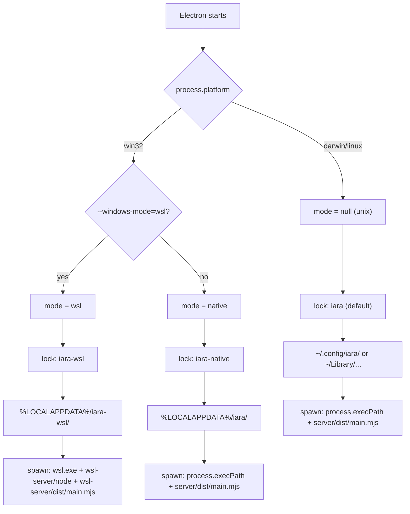

# Windows Native Support Design

**Spec**: `.specs/features/windows-native-support/spec.md`
**Context**: `.specs/features/windows-native-support/context.md`
**Status**: Draft

---

## Architecture Overview

The feature adds a native Windows server alongside the existing WSL server. On Windows, a single NSIS installer creates two shortcuts that launch the same Electron binary with different flags. Each mode resolves independently — separate server process, separate state directory, separate single-instance lock.

**Mode resolution** happens once at Electron startup and flows through the entire stack:



**Key invariant**: Native mode and WSL mode never share state. The Electron desktop-side state (window position, logs) uses mode-specific directories on the Windows filesystem. The WSL server's app state (SQLite, auth) lives inside the WSL filesystem (`~/.config/iara/`), naturally isolated.

---

## Code Reuse Analysis

### Existing Components to Leverage

| Component             | Location                                  | How to Use                                                                                       |
| --------------------- | ----------------------------------------- | ------------------------------------------------------------------------------------------------ |
| `getStateDir()`       | `packages/shared/src/platform.ts:16-25`   | Already handles Windows (`LOCALAPPDATA`). Pass mode-specific app name (`"iara"` vs `"iara-wsl"`) |
| `reservePort()`       | `apps/desktop/src/utils.ts:77-80`         | Cross-platform via `get-port`. No changes needed                                                 |
| `generateToken()`     | `apps/desktop/src/utils.ts:82-84`         | Cross-platform. No changes needed                                                                |
| `isWslAvailable()`    | `apps/desktop/src/utils.ts:14-24`         | Keep for WSL mode detection. No changes                                                          |
| `toWslPath()`         | `apps/desktop/src/utils.ts:27-32`         | Keep for WSL mode server spawn. No changes                                                       |
| `spawnServer()`       | `apps/desktop/src/main.ts:128-210`        | Already has WSL vs non-WSL branches. Native Windows reuses the non-WSL branch                    |
| `killProcessTree()`   | `packages/shared/src/platform.ts:129-146` | Uses `tree-kill` which supports Windows via `taskkill /T /F`. No changes needed                  |
| `TerminalManager`     | `apps/server/src/services/terminal.ts`    | Calls platform.ts for shell/env — works once platform.ts is fixed                                |
| `default-shell` (npm) | Used in `platform.ts:4`                   | Returns `COMSPEC` on Windows (typically `cmd.exe`). Cross-platform, no changes                   |
| `tree-kill` (npm)     | Used in `platform.ts:5`                   | On Windows, uses `taskkill /pid N /T /F`. Already cross-platform                                 |
| `node-pty` (npm)      | Used in `terminal.ts:2`                   | Supports Windows natively via ConPTY. Already cross-platform                                     |

### Integration Points

| System              | Integration Method                                                                                                  |
| ------------------- | ------------------------------------------------------------------------------------------------------------------- |
| Desktop → Server    | Server spawn in `main.ts:128-210` branches on mode. Native Windows and unix use the same code path (non-WSL branch) |
| Server → Shell      | `platform.ts` functions called by `terminal.ts` and `supervisor.ts`. Windows branches added to platform.ts          |
| Release → Installer | `electron-builder.ts` + custom NSIS include script for dual shortcuts                                               |

---

## Components

### 1. Mode Resolution (`apps/desktop/src/main.ts`)

- **Purpose**: Determine Windows mode from CLI args and configure the app instance accordingly
- **Location**: Top of `apps/desktop/src/main.ts` (replaces current line 40)
- **Interfaces**:
  - `type WindowsMode = "native" | "wsl" | null` — `null` means non-Windows (macOS/Linux)
  - `resolveWindowsMode(): WindowsMode` — parses `--windows-mode=wsl` from `process.argv`
- **Dependencies**: `isWindows` from `@iara/shared/platform`
- **Reuses**: Existing `isWindows` constant

**Changes to main.ts:**

1. **Mode resolution** (replaces line 40):

   ```ts
   type WindowsMode = "native" | "wsl" | null;
   function resolveWindowsMode(): WindowsMode {
     if (!isWindows) return null;
     const modeArg = process.argv.find((a) => a.startsWith("--windows-mode="));
     return modeArg?.split("=")[1] === "wsl" ? "wsl" : "native";
   }
   const windowsMode = resolveWindowsMode();
   const useWsl = windowsMode === "wsl";
   ```

2. **Single-instance lock** (new, before `app.whenReady()`):

   ```ts
   // Mode-specific lock so both modes can run concurrently
   const lockKey =
     windowsMode === "native" ? "iara-native" : windowsMode === "wsl" ? "iara-wsl" : undefined; // default lock on macOS/Linux
   const gotLock = app.requestSingleInstanceLock(lockKey ? { key: lockKey } : undefined);
   if (!gotLock) {
     app.quit();
     return;
   }
   ```

   Note: `requestSingleInstanceLock` accepts an `additionalData` object. For mode-specific locking, we use Electron's built-in support: pass a unique key so each mode gets its own lock.

   **Important**: Electron's `requestSingleInstanceLock()` doesn't accept a lock key directly. The lock is per-app by default. For mode-specific locking, use `app.setPath('userData', modeSpecificPath)` before the lock — this changes the lock file location, effectively creating separate locks per mode.

3. **State dir** (replaces line 42):

   ```ts
   const stateAppName = windowsMode === "wsl" ? "iara-wsl" : "iara";
   const stateDir = getStateDir(stateAppName);
   ```

4. **Error dialog** (replaces lines 529-537):

   ```ts
   // Only show WSL-required error when in WSL mode
   if (windowsMode === "wsl" && !isWslAvailable()) {
     dialog.showErrorBox("WSL Required", "...");
     app.quit();
     return;
   }
   ```

   Native mode no longer blocks — it proceeds without WSL.

5. **spawnServer()** — No structural changes. The existing `useWsl` boolean already controls the branch. Setting `useWsl = windowsMode === "wsl"` makes it work.

6. **Window title** (cosmetic, line 311):
   ```ts
   title: isDevelopment ? "iara (Dev)" : windowsMode === "wsl" ? "iara (WSL)" : "iara",
   ```

### 2. Platform Shell Utilities (`packages/shared/src/platform.ts`)

- **Purpose**: Make shell command construction, terminal environment, and process CWD work on native Windows
- **Location**: `packages/shared/src/platform.ts`
- **Interfaces**: Same exports, behavior changes on Windows
- **Dependencies**: `default-shell` (npm), `os`, `child_process`
- **Reuses**: All existing functions — adds Windows branches

**Changes:**

1. **`buildInteractiveShell()`** (line 48-50):

   ```ts
   export function buildInteractiveShell(): { command: string; args: string[] } {
     if (isWindows) {
       return { command: defaultShell, args: [] }; // no --login on Windows
     }
     return { command: defaultShell, args: ["--login"] };
   }
   ```

2. **`buildShellCommand(cmd)`** (line 53-55):
   Detect shell type from `defaultShell` path and use appropriate wrapping:

   ```ts
   export function buildShellCommand(cmd: string): { command: string; args: string[] } {
     if (isWindows) {
       if (isPowerShell(defaultShell)) {
         return { command: defaultShell, args: ["-NoProfile", "-Command", cmd] };
       }
       // cmd.exe fallback
       return { command: defaultShell, args: ["/C", cmd] };
     }
     return { command: defaultShell, args: ["-lc", cmd] };
   }
   ```

   Helper: `isPowerShell(shell: string): boolean` — checks if path contains `powershell` or `pwsh` (case-insensitive).

3. **`shellQuote(arg)`** (line 41-45):
   Windows variant using double-quote wrapping:

   ```ts
   export function shellQuote(arg: string): string {
     if (arg === "") return isWindows ? '""' : "''";
     if (/^[a-zA-Z0-9_./:=@,+-]+$/.test(arg)) return arg;
     if (isWindows) {
       // Double-quote for cmd/PowerShell, escape inner double quotes
       return `"${arg.replace(/"/g, '\\"')}"`;
     }
     return `'${arg.replace(/'/g, "'\\''")}'`;
   }
   ```

4. **`buildTerminalEnv(overrides?)`** (line 74-87):
   Windows inherits full `process.env` instead of constructing a minimal env:

   ```ts
   export function buildTerminalEnv(overrides?: Record<string, string>): Record<string, string> {
     if (isWindows) {
       // Windows programs expect the full environment (PATH, PATHEXT, SystemRoot,
       // USERPROFILE, APPDATA, LOCALAPPDATA, COMSPEC, etc.)
       return {
         ...(process.env as Record<string, string>),
         ...overrides,
         TERM: "xterm-256color",
         COLORTERM: "truecolor",
       };
     }
     // Unix: minimal env
     const base: Record<string, string> = {
       HOME: process.env.HOME ?? "",
       USER: process.env.USER ?? "",
       SHELL: defaultShell,
       PATH: process.env.PATH ?? "/usr/local/bin:/usr/bin:/bin",
     };
     if (process.env.LANG) base.LANG = process.env.LANG;
     if (process.env.LC_ALL) base.LC_ALL = process.env.LC_ALL;
     return { ...base, ...overrides, TERM: "xterm-256color", COLORTERM: "truecolor" };
   }
   ```

5. **`getProcessCwd(pid)`** (line 94-118):
   Add Windows implementation using PowerShell/wmic:

   ```ts
   if (isWindows) {
     const { execFile } = await import("node:child_process");
     const { promisify } = await import("node:util");
     const { stdout } = await promisify(execFile)(
       "powershell.exe",
       ["-NoProfile", "-Command", `(Get-Process -Id ${pid} -ErrorAction SilentlyContinue).Path`],
       { timeout: 2000 },
     );
     // Note: PowerShell Get-Process doesn't expose CWD directly.
     // Alternative: use wmic or return null as best-effort.
   }
   ```

   **Design decision**: `getProcessCwd` on Windows is best-effort. If unreliable, return `null` — the terminal manager falls back to `initialCwd` (terminal.ts:220). This is acceptable because terminal CWD tracking is a nice-to-have, not critical.

6. **`spawnWithLoginShell()`** (line 58-67):
   Windows: skip `detached: true` (it creates a visible console window on Windows):
   ```ts
   export function spawnWithLoginShell(cmd, opts) {
     const { command, args } = buildShellCommand(cmd);
     return spawn(command, args, {
       ...opts,
       detached: !isWindows, // detached on Windows opens a new console
     });
   }
   ```

### 3. Process Management — `killByPort()` (`packages/orchestrator/src/supervisor.ts`)

- **Purpose**: Fix port-based process killing for Windows (currently uses `lsof`, Unix-only)
- **Location**: `packages/orchestrator/src/supervisor.ts:599-612`
- **Reuses**: Existing function signature, adds Windows branch

**Change:**

```ts
async function killByPort(port: number): Promise<void> {
  try {
    if (isWindows) {
      // netstat -ano finds PIDs listening on the port
      const { stdout } = await execAsync(`netstat -ano | findstr :${port} | findstr LISTENING`, {
        encoding: "utf-8",
      });
      const pids = new Set(
        stdout
          .trim()
          .split("\n")
          .filter(Boolean)
          .map((line) => line.trim().split(/\s+/).pop())
          .filter(Boolean),
      );
      for (const pid of pids) {
        try {
          process.kill(Number(pid), "SIGTERM");
        } catch {}
      }
    } else {
      const { stdout } = await execAsync(`lsof -ti:${port}`, { encoding: "utf-8" });
      for (const pid of stdout.trim().split("\n").filter(Boolean)) {
        try {
          process.kill(Number(pid), "SIGTERM");
        } catch {}
      }
    }
  } catch {}
}
```

Import `isWindows` from `@iara/shared/platform` at the top of supervisor.ts.

### 4. Release Pipeline (`scripts/release/`)

- **Purpose**: Build and bundle both native Windows server and WSL server in a single installer
- **Location**: `scripts/release/index.ts`, `scripts/release/electron-builder.ts`
- **Reuses**: Existing non-Windows build path for native server, existing `build-wsl-server.ts` for WSL server

**Changes to `index.ts`:**

1. **Step 1 — Build** (lines 35-60): Remove the Windows special case. Windows builds all packages the same way as non-Windows:

   ```ts
   if (opts.skipBuild) {
     // Validate build artifacts exist (same for all platforms)
     for (const dir of ["apps/desktop/dist-electron", "apps/server/dist", "apps/web/dist"]) { ... }
   } else {
     await $({ cwd: posix(ROOT) })`bun build:desktop`;
   }
   ```

2. **Step 2 — Stage** (lines 93-108): Windows stages BOTH `server/` (native) and `wsl-server/`:

   ```ts
   // Stage native server (all platforms including Windows)
   const serverDistStaged = resolve(STAGING, "extraResources/server/dist");
   mkdirSync(serverDistStaged, { recursive: true });
   cpSync(resolve(ROOT, "apps/server/dist"), serverDistStaged, { recursive: true });

   // Windows also needs the WSL server bundle (from CI artifact)
   if (isWin) {
     for (const required of ["node", "dist", "node_modules"]) {
       if (!existsSync(resolve(wslServerDir, required))) {
         console.error(`ERROR: ${resolve(wslServerDir, required)} does not exist...`);
         process.exit(1);
       }
     }
   }
   ```

3. **Step 3 — Deps** (lines 130-150): Install native server deps for ALL platforms including Windows:
   ```ts
   // Server production deps (all platforms)
   const serverPkg = readJson(...);
   const serverDeps = resolveProductionDeps(...);
   writeFileSync(resolve(serverModulesDir, "package.json"), ...);
   await $({ cwd: posix(serverModulesDir) })`bun install --production`;
   ```
   Remove the `if (!isWin)` guard.

**Changes to `electron-builder.ts`:**

1. **`getExtraResources()`** (lines 73-87): Windows includes both server and wsl-server:
   ```ts
   function getExtraResources(platform: Platform): ExtraResource[] {
     const resources: ExtraResource[] = [
       { from: "extraResources/server/dist", to: "server/dist" },
       { from: "extraResources/server/node_modules", to: "server/node_modules" },
       { from: "extraResources/web", to: "web" },
     ];
     if (platform === "win") {
       // Also bundle WSL server for "Iara (WSL)" mode
       resources.push(
         { from: "extraResources/wsl-server/node", to: "wsl-server/node" },
         { from: "extraResources/wsl-server/dist", to: "wsl-server/dist" },
         { from: "extraResources/wsl-server/node_modules", to: "wsl-server/node_modules" },
       );
     }
     return resources;
   }
   ```

**`build-wsl-server.ts`**: No changes. Still runs on Linux CI to produce the WSL server artifact.

### 5. NSIS Dual Shortcuts (`apps/desktop/resources/installer.nsh`)

- **Purpose**: Create both "Iara" and "Iara (WSL)" Start Menu shortcuts from a single NSIS installer
- **Location**: New file `apps/desktop/resources/installer.nsh`
- **Dependencies**: electron-builder's `nsis.include` config

**New file `apps/desktop/resources/installer.nsh`:**

```nsis
!macro customInstall
  ; electron-builder creates the default "iara" shortcut.
  ; Add the WSL variant shortcut alongside it.
  CreateShortCut "$SMPROGRAMS\iara\iara (WSL).lnk" "$INSTDIR\iara.exe" "--windows-mode=wsl"
!macroend

!macro customUnInstall
  Delete "$SMPROGRAMS\iara\iara (WSL).lnk"
!macroend
```

**Changes to `electron-builder.ts`** — Add `nsis` config to `winConfig()`:

```ts
function winConfig(arch: Arch[]): PlatformBuildConfig {
  return {
    platformConfig: {
      win: {
        target: [{ target: "nsis", arch }],
        icon: "resources/icon.ico",
        forceCodeSigning: false,
        artifactName: "iara-${version}-win-${arch}.${ext}",
      },
    },
    formatConfigs: {
      nsis: {
        include: "resources/installer.nsh",
      },
    },
  };
}
```

---

## Error Handling Strategy

| Error Scenario                                | Handling                                                                                                | User Impact                                                                           |
| --------------------------------------------- | ------------------------------------------------------------------------------------------------------- | ------------------------------------------------------------------------------------- |
| "Iara (WSL)" launched, WSL not installed      | `isWslAvailable()` returns false → error dialog with install link → app quits                           | Clear message: "WSL is required. Install it by running: `wsl --install`"              |
| "Iara" launched, native server fails to start | Existing restart logic in `scheduleRestart()` (exponential backoff, max 8s)                             | Server auto-restarts. After repeated failures, Electron stays open but non-functional |
| Both modes launched, port collision           | Impossible by design — `get-port` finds unused ports per-instance                                       | None                                                                                  |
| Both modes launched, lock collision           | Mode-specific `userData` paths → separate lock files → no collision                                     | None                                                                                  |
| node-pty fails to load on Windows             | `pty.spawn()` throws → terminal.ts `onExit` fires with non-zero code                                    | Terminal shows error in UI. Server continues running                                  |
| `getProcessCwd()` fails on Windows            | Returns `null` → falls back to `initialCwd`                                                             | Terminal CWD indicator shows initial directory instead of current. Non-critical       |
| PowerShell execution policy blocks `-Command` | Interactive terminals still work (no profile script needed). Script execution via orchestrator may fail | User sees PowerShell error in script output. Interactive shell still usable           |
| `killByPort()` fails on Windows               | `netstat`/`findstr` fails → catch block ignores → port stays occupied                                   | Pre-existing service detected as "healthy" by supervisor. Manual cleanup needed       |

---

## Tech Decisions

| Decision                        | Choice                                                            | Rationale                                                                                                                                                |
| ------------------------------- | ----------------------------------------------------------------- | -------------------------------------------------------------------------------------------------------------------------------------------------------- |
| Mode-specific Electron lock     | Set `userData` path per mode before `requestSingleInstanceLock()` | Electron's lock is tied to `userData` directory. Different paths = different locks. No custom lock mechanism needed                                      |
| Windows shell detection         | Defer to `default-shell` npm package                              | Already used cross-platform. Returns `COMSPEC` (typically `cmd.exe`) on Windows. Per context.md, no custom detection                                     |
| PowerShell vs cmd detection     | Check if `defaultShell` path contains "powershell" or "pwsh"      | Needed to choose between `-Command` (PowerShell) and `/C` (cmd) wrapping. Simple string match on the resolved path                                       |
| `buildTerminalEnv()` on Windows | Inherit full `process.env`                                        | Windows programs need SystemRoot, PATHEXT, COMSPEC, etc. Unix's minimal-env approach doesn't work on Windows                                             |
| `detached: false` on Windows    | Skip `detached` flag in `spawnWithLoginShell()`                   | On Windows, `detached: true` opens a new console window for each child process. Undesirable for background script execution                              |
| `getProcessCwd()` on Windows    | Best-effort via PowerShell, fallback to `null`                    | No reliable cross-platform API for process CWD. Terminal falls back to `initialCwd`. Low-impact if unavailable                                           |
| WSL mode Electron state dir     | `%LOCALAPPDATA%/iara-wsl/`                                        | Separates desktop-side state (window position, logs) from native mode's `%LOCALAPPDATA%/iara/`. WSL server state remains at `~/.config/iara/` inside WSL |
| Release pipeline: server build  | Remove Windows special-case, build server same as non-Windows     | Electron's bundled Node.js runs the server natively. No separate Node binary download needed (unlike WSL which needs a Linux binary)                     |
| NSIS shortcuts                  | Custom `installer.nsh` with `customInstall` macro                 | electron-builder's `nsis.include` is the standard way to add custom install steps. Minimal NSIS scripting — just creates one extra shortcut              |
